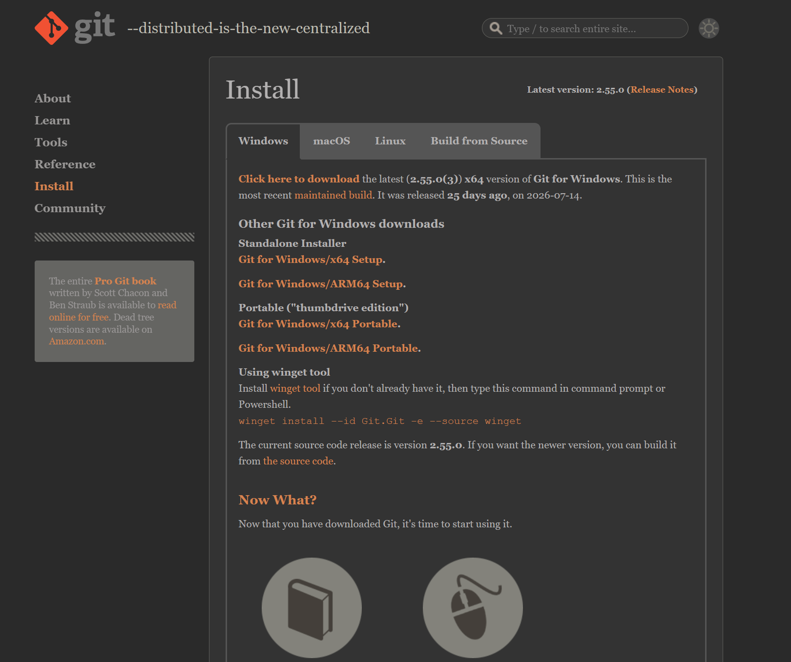
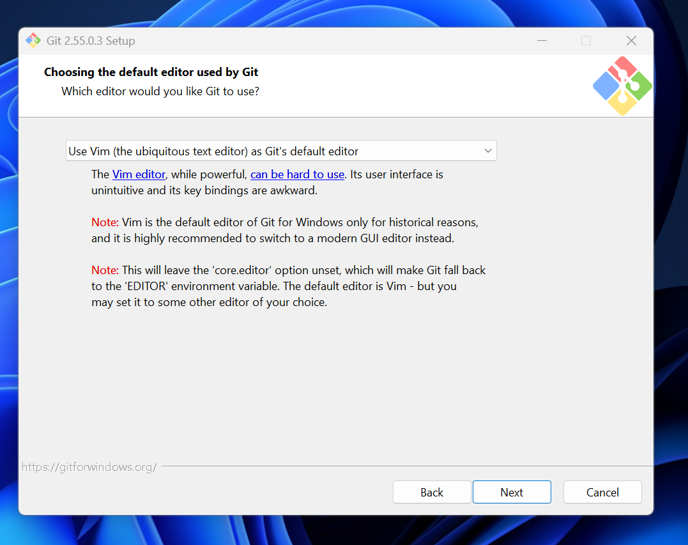
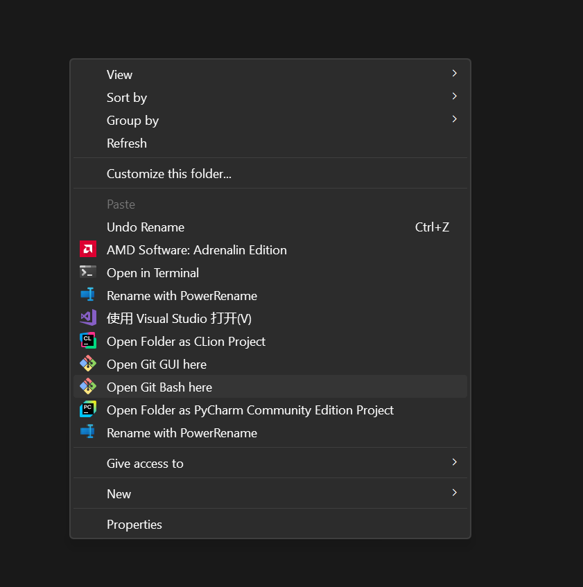
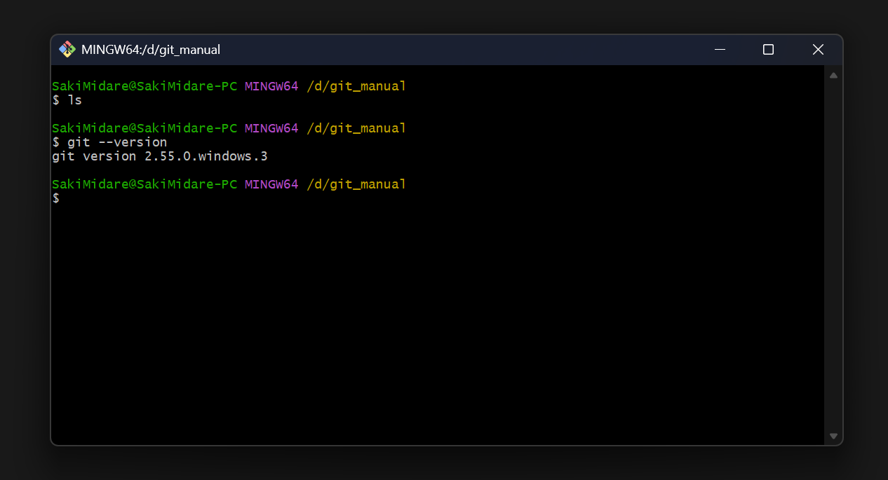
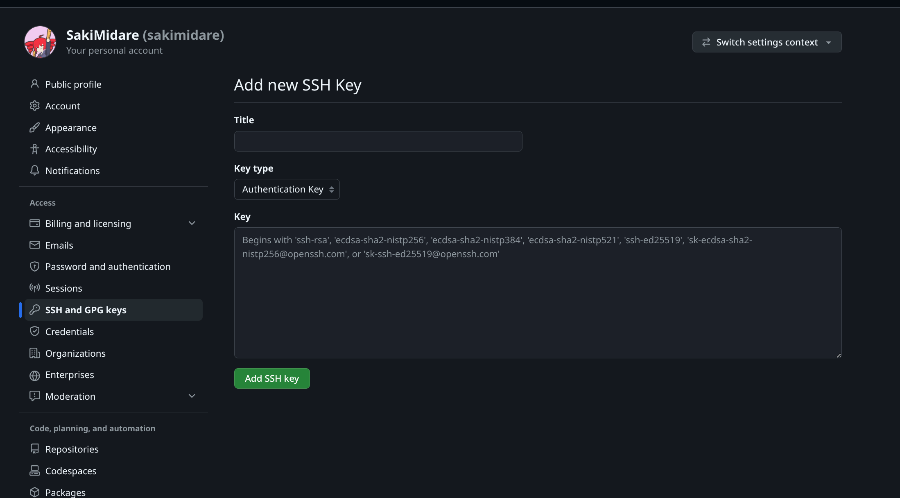
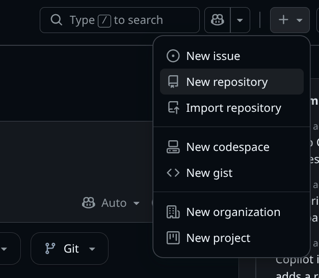
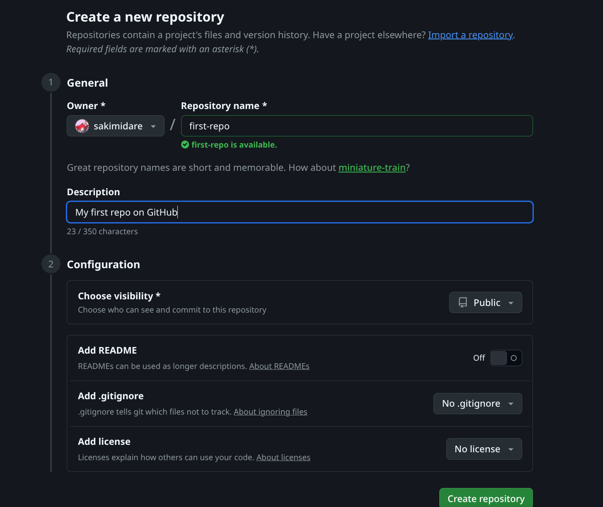
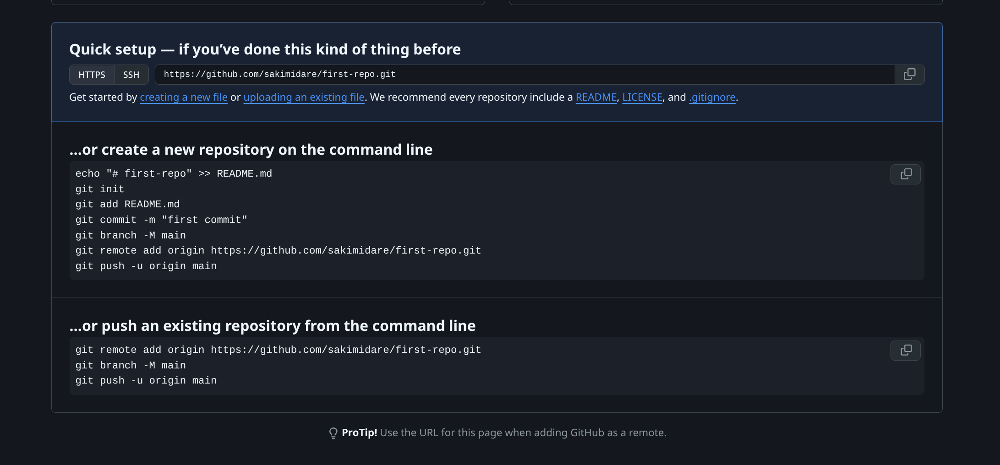
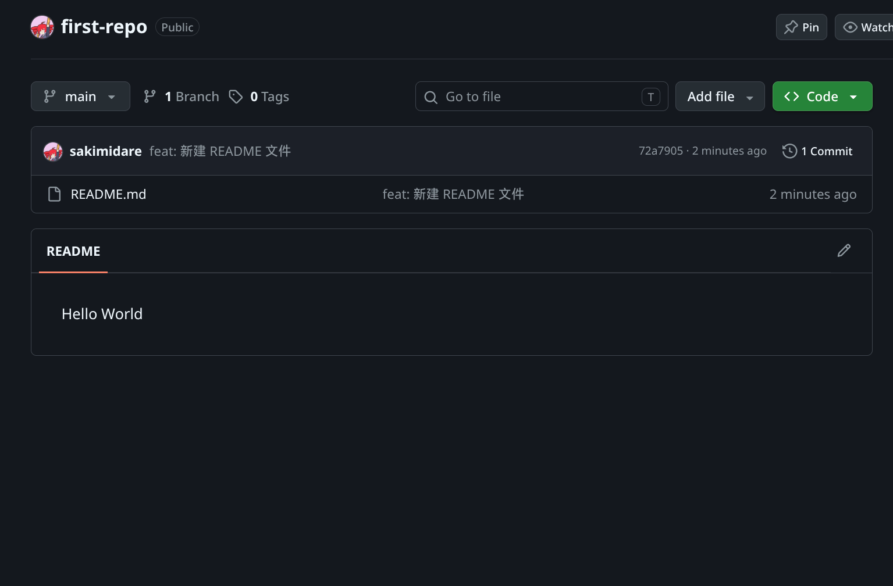

# Git 与 GitHub

> [!TIP]
> 在阅读此文前，建议先阅读 [Visual Studio Code](/chapters/devops/vscode) 和 [终端与命令行](/chapters/devops/terminal)。因为安装 Git Bash 时，可以设置 VS Code 作为默认编辑器。且使用 Git Bash 需要读者有初步的命令行知识。

> [!IMPORTANT]
> 本文的操作全部基于 Windows 10/11。命令的运行全部使用 Git Bash。

## 为什么需要 Git？

如果你写过一些需要频繁改动的文档，你一定不会对这样的文件命名感到陌生：

> `项目_草稿.docx`
> 
> `项目_修改版.docx`
> 
> `项目_最终版.docx`
> 
> `项目_绝对不改最终版.docx`
> 
> `项目_打死不改最终版_v2.docx`

当你发现 `绝对不改版` 里有一段内容写坏了，想要找回第一天写的 `草稿` 里的某句话时，往往已经找不到了。如果这时候还要和三四个同学一起改同一份文件，大家互相传来传去，最后根本不知道谁改了什么，甚至会把别人的心血不小心覆盖掉。

Git 就是为了终结这种混乱而诞生的。 简单来说，Git 是一个版本控制系统。你只需要把每次更改的内容告诉 Git，它就能帮你自动、高效地管理文件的每一次修改。既方便，又因为 Git 会对历史进行智能压缩存储，不会像"每个版本存一个文件"那样占用大量磁盘空间。

## 安装 Git

1. 进入[官网](https://git-scm.com/install/windows)，选择 “Git for Windows/x64 Setup” 下载。下载可能较慢，读者可以参考 [爱的魔法](/chapters/devops/vpn) 加快下载速度。
   
2. 一路点下一步，到“Choosing the default editor”这一步时，推荐选择“[Visual Studio Code](/chapters/devops/vscode)”。
   

> [!TIP]
> 作为 Git 的默认编辑器，Vim 是一个强大、历史悠久、轻量且插件丰富的终端编辑器，但其不直观的键位绑定和晦涩的操作方式不适合新手。我们建议你使用具有现代 GUI 的 Visual Studio Code。

3. 一路点下一步，直到安装完成。此时，右键文件管理器中任一文件夹的空白部分，应该会出现“Open Git Bash here”选项（Windows 11 用户需要点击“显示更多选项”来发现这个选项）。
   
4. 点击“Open Git Bash here”。如果出现一个如下图所示的黑窗口，证明 Git 安装成功。
   

> [!Tip] 什么是 Git Bash？
> Git Bash 是 Windows 系统上的类 Unix 命令行环境。它不仅内置了完整的 Git 版本控制工具，还支持常用的 Linux 命令行语法，是 Windows 开发者在终端中高效执行代码管理与 Shell 脚本的首选工具之一。有关命令行的相关知识，参见 [终端与命令行](/chapters/devops/terminal)。

## 使用 Git

### 创建仓库

仓库（Repository，简称 Repo）就是 Git 用来保存你所有文件历史记录的“小基地”。你可以把任何一个普通文件夹变成 Git 仓库。接下来让我引导你一步步创建第一个 Git 仓库。

1. 选择一个合适的地方，新建一个空文件夹，这就是我们的仓库所在的文件夹；
2. 在这个空文件夹右键，选择 “Open Git Bash here”，打开 Git Bash。
3. 输入以下命令：

```sh
git init
```

  如果你是第一次使用 Git，那么 Git 大概会输出以下信息：

```
hint: Using 'master' as the name for the initial branch. This default branch name
hint: will change to "main" in Git 3.0. To configure the initial branch name
hint: to use in all of your new repositories, which will suppress this warning,
hint: call:
hint:
hint:   git config --global init.defaultBranch <name>
hint:
hint: Names commonly chosen instead of 'master' are 'main', 'trunk' and
hint: 'development'. The just-created branch can be renamed via this command:
hint:
hint:   git branch -m <name>
hint:
hint: Disable this message with "git config set advice.defaultBranchName false"
Initialized empty Git repository in /home/git-test-user/git/.git/
```

> [!NOTE] 这一大段 hint 是什么？
> 这**不是报错**，只是 Git 的提示。它想说两件事：
> * Git 目前的默认分支名是 `master`（历史遗留问题，和后面“重命名默认分支为 `main`”那一步相关），并预告未来的 Git 3.0 会改用 `main`；
> * 如果你想让它闭嘴，可以设置默认分支名，例如运行 `git config --global init.defaultBranch main`，之后新建的仓库默认就是 `main` 分支了。
>
> 作为新手，暂时无视它、继续往下走完全没问题。

上面的输出告诉我们：
```
Initialized empty Git repository in /home/git-test-user/git/.git/
```
  这说明当前目录已经顺利初始化，成为了一个 Git 仓库！此时文件夹下会生成一个隐藏的 `.git` 文件夹，这就是 Git 用来记录版本历史的核心数据库，请不要手动修改或删除它。

### 配置你的身份

在第一次提交之前，Git 需要知道你的名字和邮箱。这些信息会被附加在提交记录里，方便日后查看"这段代码是谁写的"。请依次运行：

```sh
git config --global user.name "你的名字"
git config --global user.email "你的邮箱@example.com"
```

> [!TIP]
> * 这里配置的只是"提交者签名"，**不是** GitHub 的账号密码，不需要和注册邮箱完全一致（但建议一致）。
> * 如果你不想在公开的提交记录里暴露真实邮箱，可以在注册 GitHub 后进入 **Settings → Emails**，勾选 *Keep my email address private*，然后把上面邮箱换成它提供的 `xxxxx@users.noreply.github.com`。

### 第一次提交变更

在动手敲命令之前，我们需要先搞懂 Git 里的两个核心概念：**暂存区（Staging Area）** 和 **提交（Commit）**。

我们可以把 Git 的工作方式类比为**“拍照发朋友圈”**：

* **工作区（Working Directory）**：就是你当前的文件夹。你在里面新建、修改或删除文件的过程，就像是在**布景和摆姿势**。
* **暂存区（Staging Area）**：就像是**打开相机胶卷，选择要上传的照片**。你可以选一张，也可以选多张。选中的文件就是被 `git add` 标记的文件。
* **提交（Commit）**：相当于**点击“发送朋友圈”**。一旦点击提交，这一刻文件夹的状态就会被永久按下快门，生成一个独一无二的“历史记录版本”。

也就是说：**修改文件（准备） → `git add`（挑选） → `git commit`（拍照保存）**。

了解了这个流程，我们来动手操作一遍：

#### 新建测试文件

最简单的方式是直接在 Git Bash 里输入下面的命令，它会创建 `README.md` 并写入 `Hello World!`：

```sh
echo "Hello World!" > README.md
```

> [!TIP] 小心文件名
> Windows 的文件资源管理器**默认隐藏扩展名**。如果用"新建文本文档"再重命名，很容易得到 `README.md.txt`，Git 会把它当成一个完全不同的文件。如果你选择用鼠标操作，请务必确认最终文件名是 `README.md`；或者干脆用上面的命令创建。

#### 查看仓库状态
想知道现在文件夹里有什么变化，可以随时运行：

```sh
git status
```

输出：
```
On branch master

No commits yet

Untracked files:
  (use "git add <file>..." to include in what will be committed)
        README.md

nothing added to commit but untracked files present (use "git add" to track)
```

你会看到 `README.md` 显示为红色（Untracked files），表示 Git 注意到了这个新文件，但它目前还是草稿，尚未被放入暂存区。

#### 将文件添加到暂存区
使用以下命令把 README.md 放到暂存区：

```sh
git add README.md
```
此时再次运行 `git status`：

```
On branch master

No commits yet

Changes to be committed:
  (use "git rm --cached <file>..." to unstage)
        new file:   README.md
```

你会发现文件名变成了绿色（Changes to be committed），说明它已经准备好提交了。

> [!TIP]
> 如果修改了多个文件，可以直接运行 `git add .`（注意后面有一个英文句号），它会将当前目录下所有有变化的文件一次性全部放入暂存区。

#### 提交变更到本地仓库 (git commit)
使用 `git commit` 命令正式把暂存区里的变更永久保存下来。为了以后能看懂这次提交改了什么，我们需要用 `-m` 参数附上一句简单明确的提交说明：

```sh
git commit -m "feat: 新建 README 文件"
```

> [!NOTE]
> `feat:` 是 [Conventional Commits（约定式提交）](https://www.conventionalcommits.org/zh-hans/) 规范中表示"新增功能"的前缀。第一次提交先用它练手即可，提交说明只要你和队友能看懂就足够。

按下回车，看到：

```
[master (root-commit) 6b83eb4] feat: 新建 README 文件
 1 file changed, 1 insertion(+)
 create mode 100644 README.md
```

就代表我们的第一个提交创建成功了！

> [!TIP] 报错了？
> 
> 如果看到下面的报错：
> ```
> Author identity unknown
> 
> *** Please tell me who you are.
> 
> Run
> 
>   git config --global user.email "you@example.com"
>   git config --global user.name "Your Name"
>
> to set your account's default identity.
> Omit --global to set the identity only in this repository.
> 
> fatal: unable to auto-detect email address (got 'git-test-user@sakimidare-arch.(none)')
> ```
> 
> 说明你还没有配置名字和邮箱。回到上面的“配置你的身份”小节，运行那两条 `git config` 命令，再重新执行 `git commit` 即可。

### 查看提交历史

运行
```sh
git log
```
你会看到一条包含你的名字、邮箱、提交时间和提交说明的清晰记录。

```
commit 6b83eb430a3d1e3e1dcf02ef7f006b0deedad6d6 (HEAD -> master)
Author: SakiMidare <sakimidare@outlook.com>
Date:   Sat Aug 8 13:54:22 2026 +0800

    feat: 新建 README 文件
```

> [!TIP] 什么是 Commit Hash？
> 运行 git log 时，每条记录开头那串由字母和数字组成的长字符串（如 上面的`6b83eb4...`）叫做 Commit Hash。它是 Git 根据本次提交的所有内容（作者、时间、改动文件等）算出的唯一身份 ID。后续如果想要回退版本、查看某次修改，只需要提供这个 Hash 的前 7 位字母数字即可。

## 什么是 GitHub？

如果说 **Git** 是你电脑里的“本地相册”，那么 **GitHub** 就是“代码界的朋友圈”。

GitHub 是目前全球最大的开源代码托管平台，基于 Git 构筑。通过 GitHub，你可以：
1. **云端备份**：把本地代码同步到云端，换台电脑也能继续工作，再也不用担心硬盘损坏。
2. **开源交流**：浏览、学习、使用全球优秀开发者开源的软件和代码。
3. **多人协作**：和团队成员在同一个项目中并行开发、提交代码、互评审查。

> [!NOTE] 区分 Git 与 GitHub
> * **Git**：一个**本地命令行软件**（工具），用来记录文件的版本历史。
> * **GitHub**：一个**在线网站平台**（服务），用来在云端保存、展示和分享 Git 仓库。

## 将代码推送到 GitHub

接下来，我们把刚才在本地创建并提交的仓库，同步到 GitHub 云端。

### 注册与登录 GitHub

1. 打开 [GitHub](https://github.com/)。
2. 点击右上角 **Sign up** 注册账号（如果已有账号直接点击 **Sign in** 登录）。
3. 按照提示完成邮箱验证。

> [!TIP]
> 注册过程中如果卡在人机验证（拖拽拼图等）上，可以换用手机浏览器，或参考 GitHub 官方文档：[创建 GitHub 账号](https://docs.github.com/zh/get-started/start-your-journey/creating-an-account-on-github)。

> [!TIP]
> 如果遇到 GitHub 网页加载缓慢或无法打开的情况，可以再次借助 [爱的魔法](/chapters/devops/vpn)。

### 将本地 SSH 公钥上传到 GitHub 上

> [!TIP]
> 建议阅读：[使用 SSH 连接到GitHub](https://docs.github.com/zh/authentication/connecting-to-github-with-ssh)

我们可以把 SSH 密钥想象成一对密码锁：

* **私钥（Private Key）**：保存在你本地电脑上，绝对不能给别人看。
* **公钥（Public Key）**：上传到你的 GitHub 账号里，可以公开。

只要两边对上了，以后你在这台电脑上推拉代码时，GitHub 就能自动确认你的身份，**再也不需要每次都输入密码或进行网页验证**。

创建 SSH 密钥对的步骤请参考 [SSH 远程登录](/chapters/devops/ssh)，如果已创建密钥对，则忽略这一步。

创建完成之后，请查看你的公钥：

```sh
cat ~/.ssh/id_ed25519.pub
```

> [!NOTE]
> `cat` 命令用来查看文件内容；`~` 表示你的用户主目录（在 Git Bash 中通常对应 `C:\Users\你的用户名`）。这条命令就是把这台电脑的 SSH 公钥内容打印出来。

复制完整输出内容（一般是一个字符串和一个邮箱），粘贴到 GitHub 设置 → SSH Key → Add new SSH Key 的 Key 输入框中，标题可以随便取名（见下）：



点击 “Add SSH Key” 并验证通过。

如果配置完成后，运行

```sh
ssh -T git@github.com
```

输出

```
Hi <用户名>! You've successfully authenticated, but GitHub does not provide shell access.

```

而不是

```
git@github.com: Permission denied (publickey).
```

证明我们的 SSH Key 配置成功，可以用这个 Key 来访问 GitHub 上的仓库了！

> [!TIP]
> 如果你遇到这种输出：
> ```
> ED25519 key fingerprint is: SHA256:+xxxxx
> This key is not known by any other names.
> Are you sure you want to continue connecting (yes/no/[fingerprint])?
> ```
> 说明你的电脑没有信任 GitHub 的 公钥。请手动输入 `yes`，信任 GitHub 的公钥。

### 在 GitHub 上新建远程仓库

1. 登录后，点击页面右上角的 **`+`** 号，选择 **New repository**。

  

2. 填写仓库信息：
   * **Repository name（仓库名称）**：填入与本地文件夹一致的名称（例如 `first-repo`）。
   * **Description（可选描述）**：简单写一句项目介绍。
   * **Public / Private（公开/私有）**：初学者建议选择 **Public**（所有人可见）。
   * **不要** 勾选 *Add a README file*、*.gitignore* 或 *Choose a license*（因为我们本地已经创建过文件了，保持远端完全空白）。

3. 点击底部的绿色按钮 **Create repository**。



### 连接本地仓库与远程仓库

创建成功后，GitHub 会展示一个页面，其中包含了关键的命令指南：

  

我们想要把本地的仓库推送到 GitHub 上，请在 Git Bash 中依次进行：

#### 关联远程仓库地址

因为我们刚刚已经配置好了 SSH 密钥，这里直接使用 SSH 协议——Git 会自动用你的密钥完成身份验证，无需输入密码。执行：

```sh
git remote add origin git@github.com:你的用户名/你的仓库名.git
```

添加远程仓库地址。

> [!CAUTION] 为什么不用 HTTPS + 密码？
> GitHub 出于安全考虑，**已不再允许直接在终端输入账户密码进行登录**！如果你把上面的命令误写成了 HTTPS 形式：
> ```
> git remote add origin https://github.com/你的用户名/你的仓库名.git
> ```
> 推送时很可能出现
> ```
> remote: Invalid username or token. Password authentication is not supported for Git operations.
> fatal: Authentication failed for 'https://github.com/你的用户名/你的仓库名.git/'
> ```
> 的报错。遇到这种情况，先运行 `git remote remove origin` 删掉错误的地址，再重新用 SSH 命令添加即可。

#### 重命名默认分支为 `main`

```sh
git branch -M main
```

> [!TIP] 为什么要重命名？
> 这涉及一段历史遗留问题：早期 Git 的默认分支名是 `master`，而 GitHub 后来改用 `main` 作为默认分支名，两者并没有功能上的区别。为了让本地和远程保持一致，我们执行这条命令把本地分支改名为 `main`。

#### 推送至远程
```sh
git push -u origin main
```
`-u`（即 `--set-upstream`）表示"建立关联"：它让本地的 `main` 分支记住对应的远程分支。这样以后修改完代码，直接运行 `git push` 即可，不需要再写 `origin main`。如果输出：

```
Enumerating objects: 3, done.
Counting objects: 100% (3/3), done.
Writing objects: 100% (3/3), 248 bytes | 248.00 KiB/s, done.
Total 3 (delta 0), reused 0 (delta 0), pack-reused 0 (from 0)
To github.com:用户名/仓库.git
 * [new branch]      main -> main
branch 'main' set up to track 'origin/main'.
```

说明你的第一个仓库已经推送到了 GitHub 上了！



## GitHub 常用操作

### 克隆与拉取

看教程、复制别人的开源项目时，`git clone` 可以把远程仓库完整下载到本地：

```sh
git clone git@github.com:用户名/仓库名.git
```

`git pull` 则会把远程仓库的最新改动同步到本地（多人协作时，动手前先 pull 一下是好习惯）：

```sh
git pull
```

> [!NOTE]
> 首次运行 `git pull` / `git push` 时，如果提示 `Are you sure you want to continue connecting (yes/no/[fingerprint])`，输入 `yes` 回车即可——这只是 Git Bash 第一次连接 GitHub 时询问是否信任对方服务器。

### Star 与 Explore

打开任意项目主页，右上角的 **Star** 按钮相当于"收藏 + 点赞"。给喜欢的项目点亮星标后，它们会出现在你的个人主页，方便日后回看。

想发现优质项目，可以逛逛 GitHub 顶部的 **Explore** 页面和 **Trending**，看看最近大家都在研究什么，是新生学习代码的好入口。

### Fork 与 Pull Request

**Fork** 会把别人的仓库完整复制到你的 GitHub 账号下，之后你可以像操作自己的仓库一样修改它。通常的流程是：先 Fork，再 `git clone` 到本地修改，最后 `git push` 推回你自己账号下的副本。

如果想让原作者采纳你的改动，就点击仓库页面的 **New Pull Request** 发起一个 **Pull Request**，请求对方把你的改动合并进原项目。这也是"参与开源"的完整链路：

```
Fork → Clone → 修改 → Push → Pull Request
```

### Issue

**Issue** 是项目的“意见箱”：报告 bug、提问、提需求都可以在 Issues 页面发起。对新手来说，从给开源项目提 Issue 开始交流，比直接上手改代码更友好。

### Release

很多项目会在 **Release** 页面提供正式的发布包（比如某个软件的安装程序）。比起克隆源码自己构建，直接从这里下载通常更方便。

### GitHub Pages

GitHub 可以为仓库生成一个免费的静态网站。把 HTML 页面推送到仓库的指定分支后，在仓库的 **Settings → Pages** 里开启即可。很多人的个人主页、项目介绍页就是这么做的。

> [!NOTE] 用 GitHub Pages 搭建个人博客
> * 官方入门文档：[GitHub Pages 文档](https://docs.github.com/zh/pages)
> * [VitePress](https://vitepress.dev/zh/)：本教程的站点就是用 VitePress 搭建的，适合写文档、知识库或博客。
> * [Hexo](https://hexo.io/zh-cn/)：国内流行、中文资料最多的博客框架之一，主题丰富。
> * [Hugo](https://gohugo.io/)：基于 Go 语言，构建速度极快，主题丰富，也支持部署到 GitHub Pages。
> * [Astro](https://astro.build/zh-cn/)：新兴的静态网站框架，组件化程度高，性能好，官方也提供了部署到 GitHub Pages 的教程。

## 注意事项

### .gitignore 与安全提醒

有些文件**不应该**被提交到仓库，比如密码、密钥、包含私人信息的配置文件（如 `token.txt`、`.env`）。你可以创建一个名为 `.gitignore` 的文本文件，把不想跟踪的文件或文件夹写进去（每行一个）：

```
token.txt
.env
```

之后运行 `git add .` 时会自动跳过它们。

> [!CAUTION]
> 不要把密码、API Key、SSH 私钥等内容提交到仓库。尤其是 **Public（公开）仓库**，一旦传上去，任何人都能看到。如果误提交了，除了在本地删除，还需要在 GitHub 上更换密钥或清理历史记录。

### 不要提交大文件

Git 擅长管理文本文件，但**不适合存放大型二进制文件**（视频、安装包、数据集、模型权重等）。这类文件一旦提交进历史，仓库体积会迅速膨胀，导致 clone、pull、push 都变得很慢，而且删除后依然会残留在历史记录里。

如果确实需要分享大文件，可以：

* 用云盘、网盘分享，或使用 Git 的 [LFS（Large File Storage）](https://git-lfs.com/) 扩展；
* 或者干脆把大文件放在仓库外的路径，用 `.gitignore` 忽略掉。

### 提交前检查改动

提交前养成先看一眼"我到底改了什么"的习惯，可以避免把不该提交的文件一起提交进去。运行：

```sh
git status
```

查看有哪些文件被改动，再用 `git diff` 查看文件的具体改动内容：

```sh
git diff
```

确认无误后再 `git add`、`git commit`。这样提交历史才会干净、可读，日后回看时也能快速定位。

## 下一步

到这里你已经能独立完成"本地提交 → 云端备份"的完整流程。

需要更深入的学习时，可以参考以下资料：

* [Pro Git 中文版](https://git-scm.com/book/zh/v2)：Git 官方同源书籍，免费在线阅读，最权威也最系统。
* [廖雪峰 Git 教程](https://www.liaoxuefeng.com/wiki/896043488029600)：中文经典入门教程，通俗易懂。
* [GitHub 官方 Git 手册](https://docs.github.com/zh/get-started/using-git)：配合 GitHub 使用的官方指南。
* [Git 官方文档](https://git-scm.com/doc)：命令与选项的完整参考。

## 附录：常用命令速查表

| 命令 | 作用 |
| --- | --- |
| `git init` | 在当前文件夹初始化一个仓库 |
| `git status` | 查看当前仓库状态（哪些文件被改动） |
| `git add <文件>` | 把文件放入暂存区 |
| `git add .` | 把所有改动放入暂存区 |
| `git commit -m "说明"` | 提交暂存区内容并附上说明 |
| `git log` | 查看提交历史 |
| `git push` | 推送本地提交到远程仓库 |
| `git pull` | 拉取远程仓库的最新改动 |
| `git clone <地址>` | 把远程仓库克隆到本地 |
