---
title: "终端与命令行"
order: 2
--- 

# 终端与命令行

计算机是一个极其聪明而高效的思考机器，但是作为代价，它只听得懂0101的二进制序列。

显然，人类需要有办法和计算机沟通。如果我们声称造出一个能思考的机器却没办法和它说话，这样的事情实在是太蠢了。站在人类的视角上看，我们会希望用尽可能不费力的方式和计算机沟通。

为了解决这个问题，我们来列一个“人类-计算机-友好沟通清单”：

- 人类不喜欢直接说0101的二进制序列，原因是没有人这么说话。
- 人类喜欢尽可能直观的交互方式，原因是人不喜欢动脑。
- 计算机不喜欢自然语言，原因是自然语言充满了模糊性和歧义。计算机有绝对的精确度洁癖。
- 计算机不在乎问题的复杂度。除了时间和空间复杂度的差异，不同程序对于计算机几乎没有区别。

基于这些原则，我们不难注意到：人类越好理解的东西，计算机越难理解，反之亦然。故而，我们不加说明的给出这样的定义：计算机越好理解的东西越**底层**，而人类越好理解的东西越**上层**。将底层的东西整理为相对上层的东西，我们称之为一层**抽象**。

今天，我们几乎无需思考，只需要用鼠标点点屏幕就可以在浏览器里刷B站或者读文章，这些都有赖于程序员建立的层层叠叠的抽象。我们将这些最终呈现给用户的交互界面称为**用户界面**。

## 什么是命令行？

如果你玩过游戏minecraft，你大概率知道在聊天栏中输入"/"开头可以运行指令。比如`/weather clear`可以把天气调为晴天。

我们完全可以设想另一种作弊行为执行方式：或许在某一个平行宇宙中，mojang为玩家提供了一个完整的图形界面来运行指令，可能在某个界面中，你只需要点击"设为晴天"按钮就可以调节天气。这就是**图形用户界面**。用户只需要通过与按钮、滑块之类的图形元素交互，计算机就足够明白用户需要做什么。

对于绝大多数电脑使用者来说，使用电脑应用几乎等价于与图形界面交互，比如使用office、刷浏览器等。但是从minecraft指令执行的逻辑中，我们发现：世界上还存在另一种不依赖于图形元素、**只依赖于文本元素**的交互方式。这就是所谓的**命令行**交互。

顾名思义。在命令行交互界面中，用户通过输入一行一行的命令来告诉计算机自己的需求。在你大一会遇到的几乎所有cpp作业、以及可能参加的算法竞赛中，本质上都在被要求开发一个以命令行为用户界面的应用程序。

对于习惯使用图形界面应用的人来说，命令行界面看起来相当的”原始“，甚至有点不应该被称之为一个”应用“，因为在我们的刻板印象中，应用都是有图形界面的。但是现实是，以命令行为界面的程序与图形界面的程序没有什么地位高低的差异。当你运行了一个能打印”Hello world"的程序时，你完全可以自豪的说你制作了一个应用程序。本质上，两者的区别只在于调用了不同的接口实现输入与输出。

命令行工具并不总是原始的。事实上，现代化的命令行工具在今天仍然有着相当庞大的生态。并且随着coding agent的兴起，越来越多的人开始了对命令行工具的再发现。

# 你为什么会需要使用命令行？

假如你是一个应用生态中纯粹的消费者，事实上图形界面已经足够解决大部分问题了。但是，作为程序员，接触命令行工具几乎是提升效率的必经之路。原因如下：

- 命令行工具的抽象度往往低于图形界面，它们更接近计算机真实的工作状态，这意味着从开发者的视角看，命令行工具更利于精确的表述功能需求。
- 命令行工具的开发成本与分发难度远低于图形界面。因此，相当多的开发者向工具只有命令行，最新的技术被提出时也大概率只提供命令行界面。
- 命令行操作速度远快于图形界面。对于大多数工具，常用指令的数量是有限的。因此，熟练掌握一个命令行工具后，操作速度的唯一瓶颈就在于打字速度。而在图形工具中，你不得不重复投入大量精力在菜单中寻找你需要的功能。同时，图形应用往往比命令行应用更加笨重。操作上的延时时常会打断心流状态。
- 命令行工具的操作极易脚本化。如果你觉得一套常用的命令组合打字非常费时间，你完全可以写个简易的脚本来给这套操作起个别名。这样复杂的操作可以进一步简单化，而在图形界面中，想要实现类似的操作可能会需要你编写复杂的图形界面宏，通过模拟人类点击界面来间接实现自动操作。
- ai agent可以使用命令行工具，但是无法使用图形工具。假如你希望ai agent帮你干活，那么你必须给它提供对应的命令行工具，这对于提升效率有巨大的意义。

总而言之，命令行工具在各个方面都显著优于图形工具。唯一的门槛在于，记忆并熟练使用命令行工具确实存在一定的脑力成本。

### 一个简单的例子

我们接下来用一个简单的例子尝试展示命令行工具的优势，我们将使用Windows自带的包管理器**WinGet**来安装一些基本的开发工具。所谓的包管理器，你可以将手机的应用市场与之类比。用户可以通过包管理器来搜索、安装、升级、卸载应用，但是一切都需要通过命令行来完成。

假设你是一个Windows用户（Linux用户大概率不会点开本文章），点击开始菜单，你会注意到一个叫做“终端”的应用。点开它，你就进入了**Powershell**。

> 所谓的**终端**代表一类应用，专业定义下，终端指用户与计算机进行文本形式输入/输出交互的端点设备或软件界面。在Minecraft中，你可以将整个聊天栏看作一个终端。但是正如minecraft中真正执行指令的是背后的游戏程序，终端并不负责解释执行指令。在计算机系统中实际解释执行指令的是所谓的**Shell**。终端只是Shell的一个美化交互界面。我们后文会讲到Shell的定义。

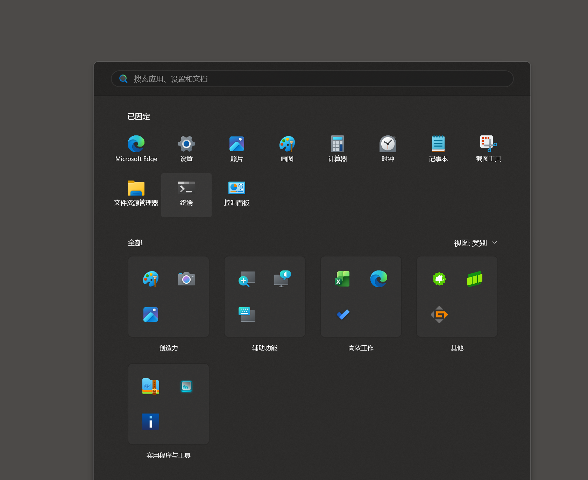

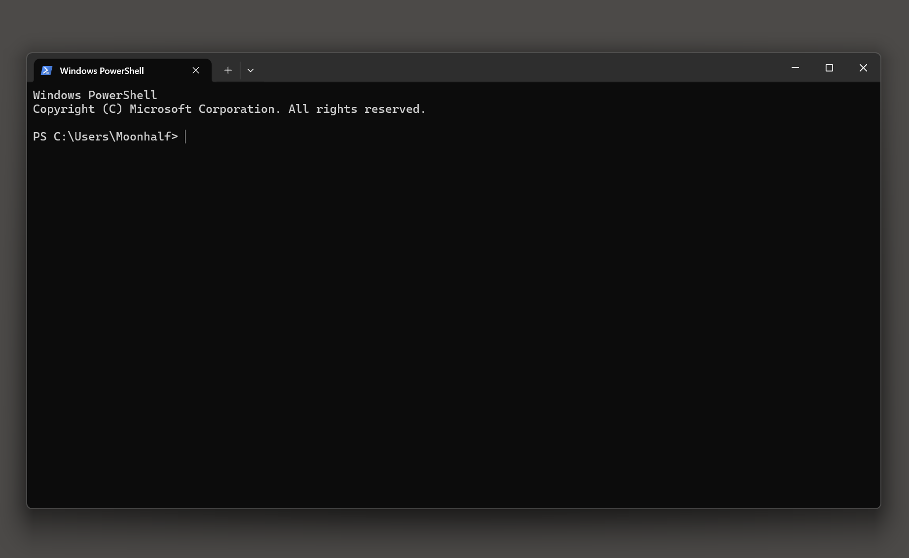

输入以下指令：

```sh
winget --help
```

你就得到了以下输出：

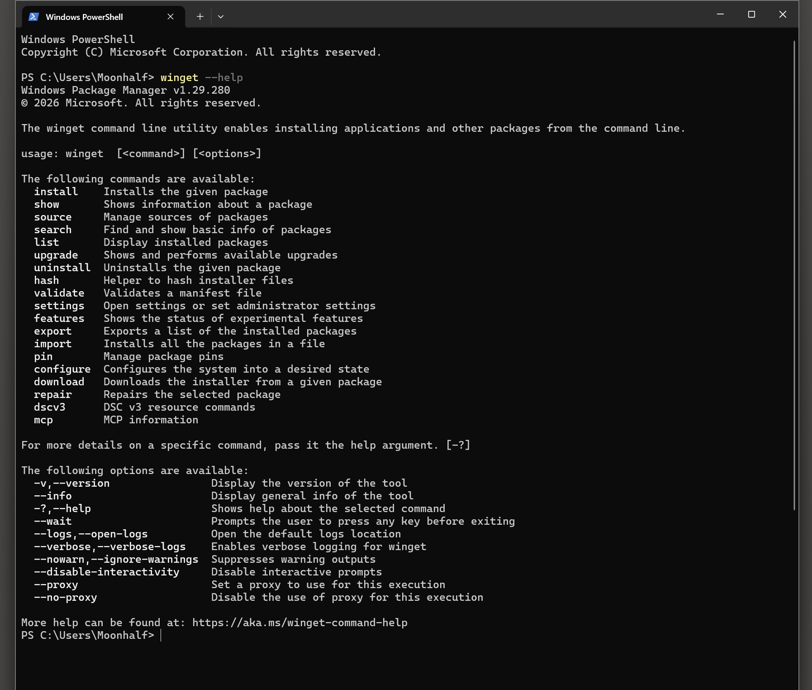

绝大多数的命令行工具都有`--help`参数，因为我们并不总能记住所有工具的用法。通过`--help`参数，你可以得到一个工具的功能概要以及使用方法。

可以看到，在`The following commands are available`下罗列了一系列子指令。其中第四条是`search: Find and show basic info of packages`。那么，就让我们先来search一下git：

```sh
winget search git
```

> Git是一个分布式的版本管理工具，你可以简单理解为一个属于程序员的“游戏存档器”，但是它的功能远比游戏存档要强大，因为它提供了存档分支与合并的功能。
> 一方面作为程序员总会遇到不小心把代码写乱的情况。天然的，你会去想在这种不安全的情况下先去存个档；另一方面，当多人合作开发一个项目时，我们会需要每个人维护一个分支来并行开发不同功能，并在之后合并为一个完全体。

输出如下：

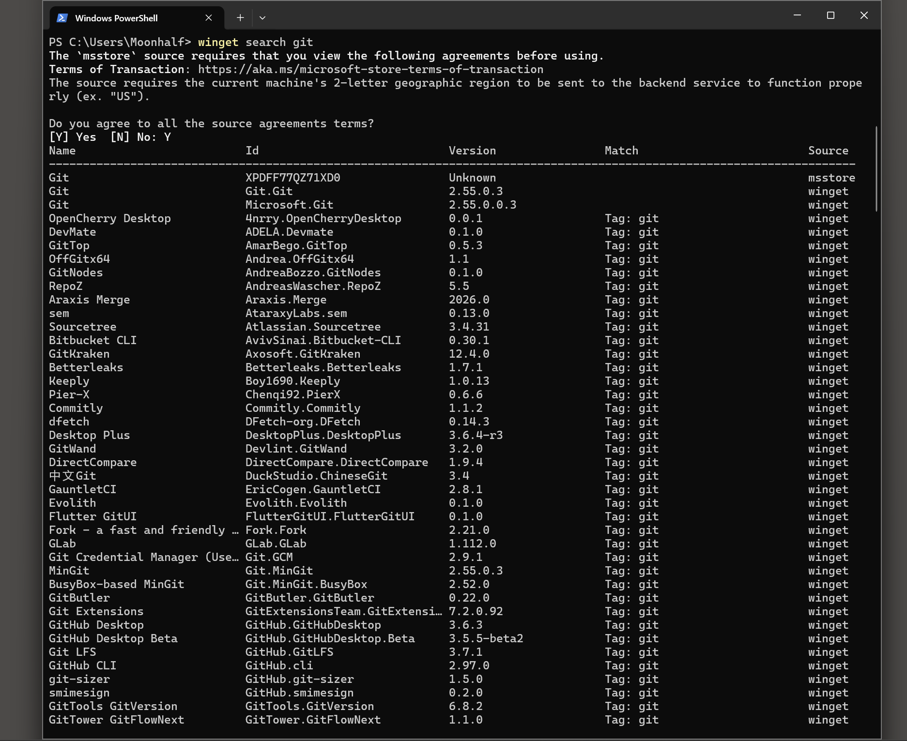

非常好！我们找到了一些和git相关的包。接下来我们来下载其中的`Git.Git`：

```sh
winget install --id Git.Git -e
```

> 怎么知道该输入这个指令的呢？你可以通过`winget install -h`来查看具体的使用方法，不过在ai时代，很多问题其实只需要问一下大语言模型就能得到答案。

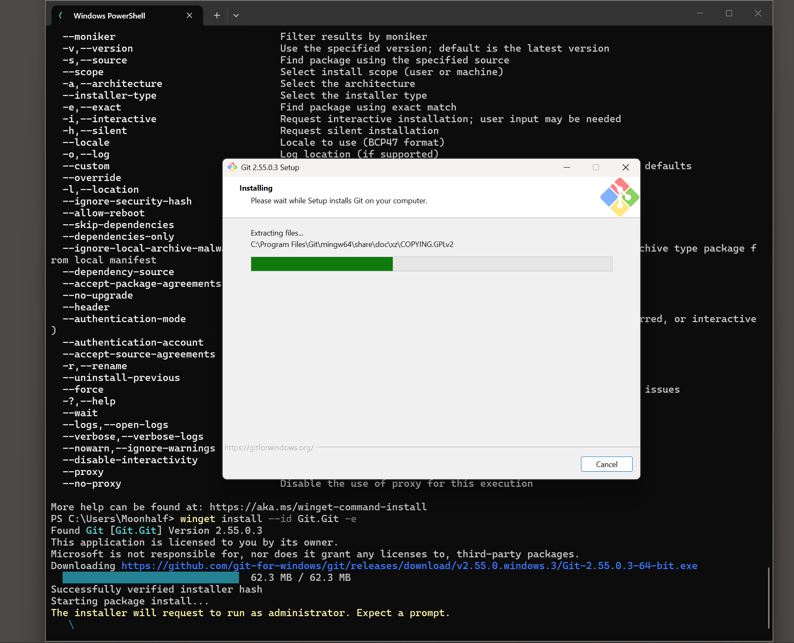

下载完成后，你就可以在开始菜单看到git了。通过包管理器winget，你无需通过浏览器访问任何网站就可以下载你所需的应用以及各种工具，这就是命令行带给程序员的显著便利之一。

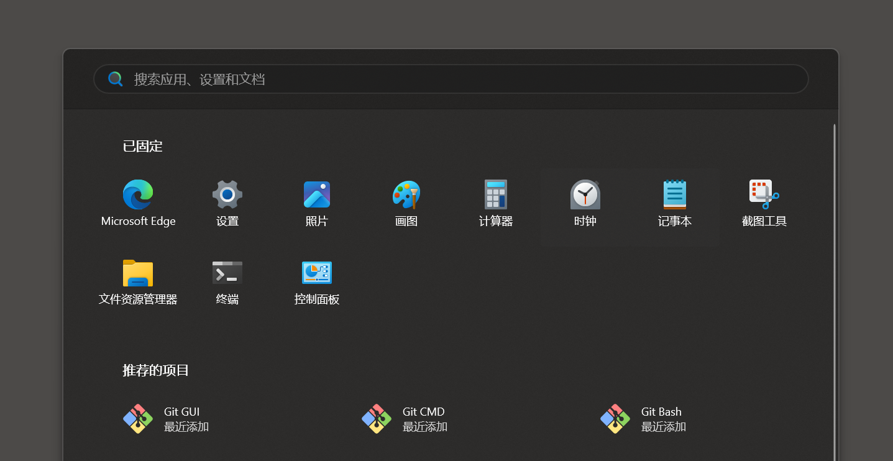

其中，我们注意到有一个应用叫做“Git Bash”。Windows的原生指令执行依赖于Powershell，你可以这样理解：对于任何输入的指令，Powershell会负责将其逐句解释并执行。但是在不同的系统上存在着不同的指令语法，因而我们也需要不同的指令解释器来做这件事。这种指令解释器的专业名称叫做**Shell**。Powershell是一种windows原生的shell，而bash则是一种Unix/Linux环境下的常见shell。

由于Git最初在Unix/Linux中发展而来，相当多的Git脚本有赖于Unix Shell的环境，因此在Windows下附带了提供unix指令兼容环境的Git Bash终端。然而，Git Bash并不与使用Git直接相关。你可以使用Git Gui，也可以直接在Powershell中使用Git。但是如果你想直接使用大部分基于Unix sh的Git脚本，恐怕就必须要依赖于Git Bash提供的Unix命令兼容环境了。

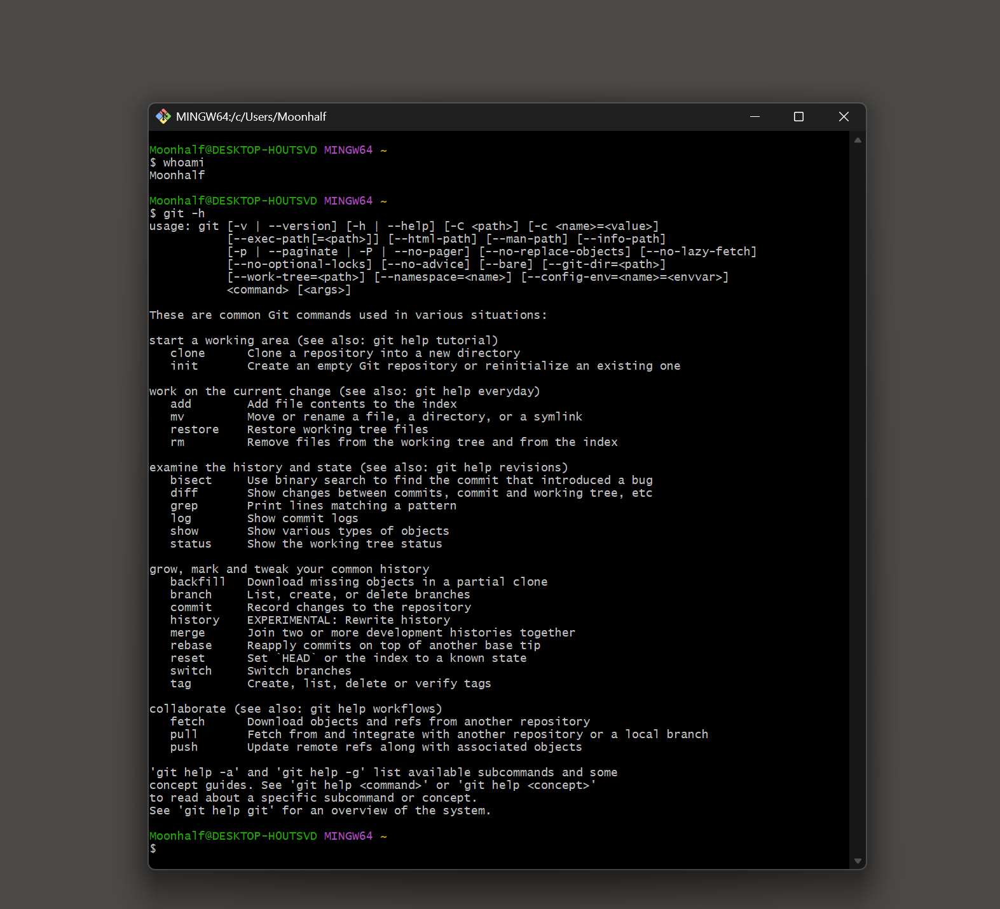

我们如法炮制，来安装python和vscode。前者是一个当下相当热门的解释型语言的解释器（只要你学的内容和ai有关，你会有相当的几率在未来1-2年内或早或晚地学习到python），而后者是一个插件生态巨大的文本编辑器，你可以通过添加插件使vscode可以用于开发几乎所有语言的项目。

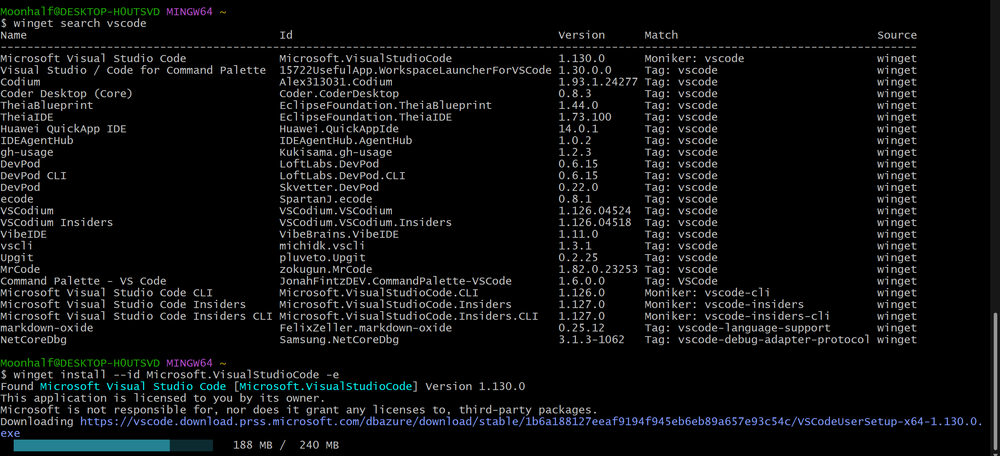

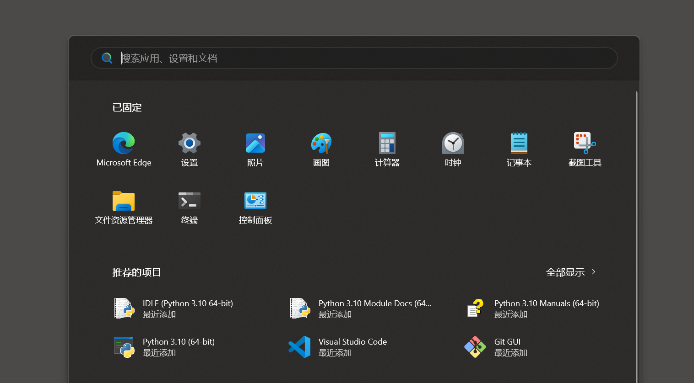

（python下载的图片似乎被我弄丢了，但是方法完全一致）。详细的使用方法可以在本站的其他文档中看到，不再过多赘述。

## Git Bash基本用法

因为Unix Shell的生态更加丰富、对脚本的兼容性更好，接下来的基本用法讲解都将围绕于Unix风格的Shell指令。可能有一部分并不能直接用于Powershell，在那些情况下，应该善用ai辅助获取所需的知识。

> 即使git bash提供了unix兼容环境，在windows上仍然有相当多的不便。彻底的解决方案是使用wsl来运行一个真正的linux子系统，或者为电脑刷入一个Linux发行版。不过这些都是高级需求了。

在Unix设计哲学下，有一个基本理念是你可以把所有东西看成一个文件。文件系统通过目录构成了一个“树形”结构，这就像是一个地图，你的所有文件都可以在这上面找到一个位置。作为Shell的使用者，显然你会有如下的需求：

- 你需要有办法知道你在哪以及周围有什么。
- 你需要有办法移动。
- 你需要有办法创建文件&目录。
- 你需要有办法删除文件&目录。
- 你需要有办法编辑文件。

好消息是，以上功能在Unix Shell中都有对应。我们来依次讲解。

```sh
pwd
```

获得当前所在的目录的路径，即告诉你现在你所处的位置（虽然大多数时候shell的prompt都会显示位置）。

```sh
ls
```

列出当前目录下文件以及子目录。你也可以附加一个路径来列出指定目录下的文件，但是大多数时候`ls`就够用了。

```sh
cd <path_name>
```

移动到某个路径。不同于Powershell中每个目录间由`\`分割，Unix使用正斜杠`/`来分隔路径。

在Git Bash下，你会注意到prompt中有一个`~`符号，这个符号代表**家目录**。你可以通过`cd ~`移动到家目录，也可以通过`~/Desktop`来表示你的桌面。

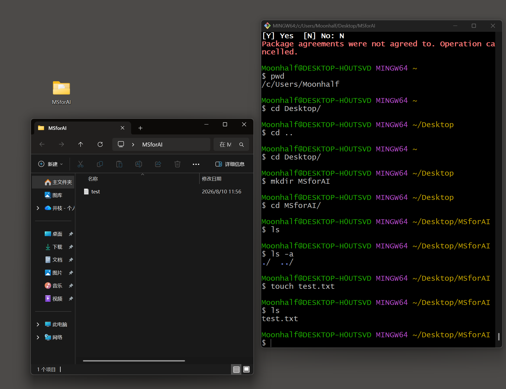

在每个目录下有两个特殊的条目：`.`和`..`，分别表示当前目录自己以及上一级目录。`cd .`即移动到自己现在在的位置（即不动），`cd ..`表示移动到父目录。后者日常使用频率较高，前者在一些特殊的必须强调只能运行当前目录下的xx时才会用到。

```sh
mkdir <path_name>
```

新建文件夹。这里的路径可以是绝对路径，也可以是相对路径。但是要求目标目录的父目录必须存在（比如`mkdir A/B/C`要求`./A/B/`必须存在，否则会报错）。

```sh
mkdir -p <path_name>
```

一次性构建一串目录，即使缺少父目录也会自动补全。`-p`是`--parents`的缩写。

```sh
rm <path_of_file>
```

删除一个文件。

```sh
rm -rf <path_of_directory>
```

递归、强制删除一个目录。通常是一个具有相当危险性的指令。

```sh
mv <path_a> <path_b>
```

把文件a移到路径b。同一个目录下可以用于文件或者目录重命名。目录整体移动需要`-f`参数。

```sh
touch <path_of_file>
```

创建一个空文件在指定目录。

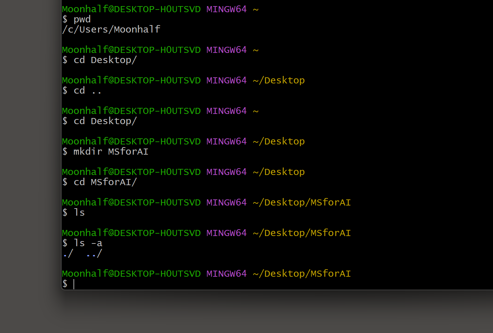

在如图的例子中，我们在桌面上创建了一个`MSforAI`文件夹，之后又在里面创建了一个空的`test.txt`文件。至于编辑文件，你可以直接使用我们前一节安装的vscode。

不过用vscode编辑文件还是太average了。应该想见，在过去没有图形界面的时代，人们仍然有办法高效的利用终端进行代码开发。因而，本节接下来会介绍一些终端文本编辑器与开发工具。

### Vim与Neovim

> 事实上终端文本编辑器的种类相当丰富，此处只简单讲解其中至今仍然相对流行的Vim编辑器。

上世纪70年代带有屏幕终端的计算机开始出现。但是那时候的电脑没有鼠标、没有图形界面，甚至键盘连方向键都没有。在1976年，两个统治世界几十年的文本编辑器同年诞生：**vi**和**EMACS**。本文中我们只讲解vi以及其后来的各种优化版，因为emacs的现代发行版主要使用独立gui工作。

vi是**visual**的缩写，原因是在此之前的文本编辑器都是所谓的**行编辑器**，即每次只能看到一行文本，看不到整个文件的状况。屏幕终端的出现为一次性看到整个文件提供了可能，这也促成了vi的诞生。而受限于彼时的硬件条件，vi的操作极大的依赖于键盘的核心区，这样的操作逻辑虽然不符合直觉，但在熟练之后可以极大地提高打字效率。因而即便在五十年后的今天，vi的操作模式仍然广泛存在于各类现代开发工具中。

vi之所以能做到只用键盘核心区就完成文本编辑操作，核心特性在于所谓的**模态编辑**：vi中有不同的模式，在不同模式下，相同的按键可以表示不同的语义。听起来很高大上，其实可以归结如下：

- normal模式：光标移动、进行文本的移动和删改。
- insert模式：就和一般的文本编辑器一样，允许输入文本。
- command模式：输入指令，你需要切换到这个模式才能保存退出。

如何切换模式呢？默认的vi配置提供了这样的切换方式：

- 任何模式 -> normal：按`ESC`。
- normal -> insert：按`i`将竖直光标插入到所选字符左边，或者按`a`插入到右边。
- normal -> command：按`:`
- 退出vi：command模式下输入`q`，回车。需要保存则输入`wq`表示写入并退出。

没有方向键怎么移动光标呢？vi提供了一个即使在现在的眼光看也非常懒人的方案：

- normal模式下h，j，k，l分别对应左，下，上，右。

懒人的原因在于你的手几乎不用任何移动就能随意移动光标。

#### 一个简单的例子

我们来从一个简单的例子上手vi：全程只在终端完成一个简单的python程序编写并运行。

效果图：

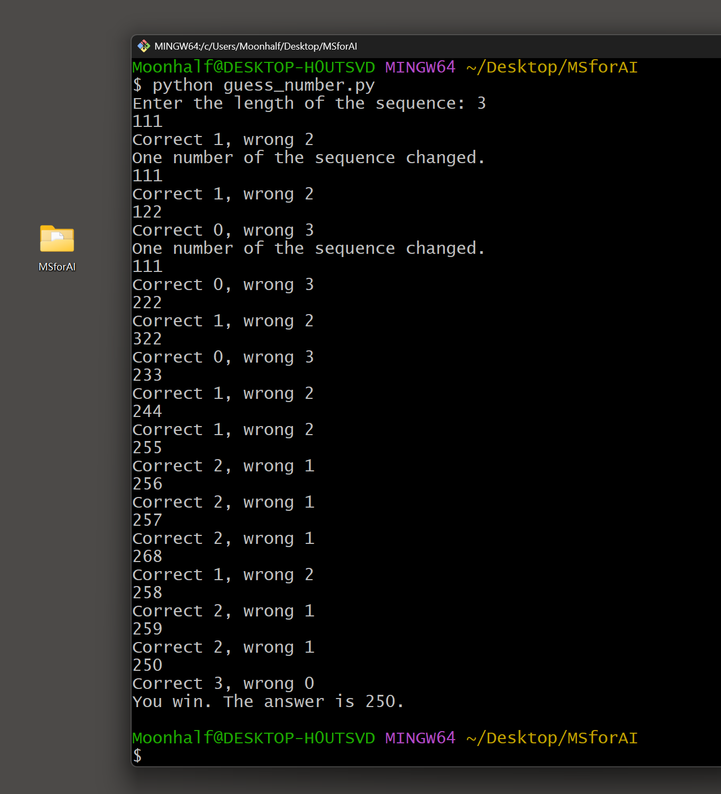

这是一个简单的猜数字游戏。程序会生成一串随机的数字序列，每次玩家给出一个数字序列的猜测，程序反馈给玩家有多少个数字猜对了。如果序列完全匹配则胜利，否则有30%的概率随机改变任意一个数字。

首先，让我们先通过`python -V`来检查python是否就绪，我们的程序需要python解释器进行解释执行。之后移动到我们准备的目录，并创建对应的空文件。`cat guess_number.py`返回为空，证明此时文件确实没有任何内容。

> 通常python安装的时候会自动将自身加入**环境变量**。简单来说，只有在环境变量的`PATH`中出现的路径下的可执行文件可以被自动发现。如果`python -V`没有正常输出结果，请你检查系统的环境变量是否正常。

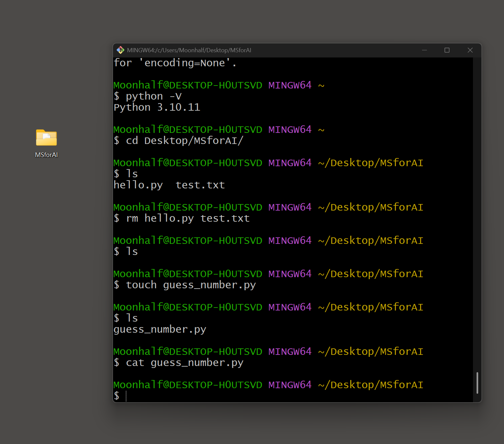

vim是vi的后来优化版。在此之后输入`vim guess_number.py`，我们进入了vim的界面。

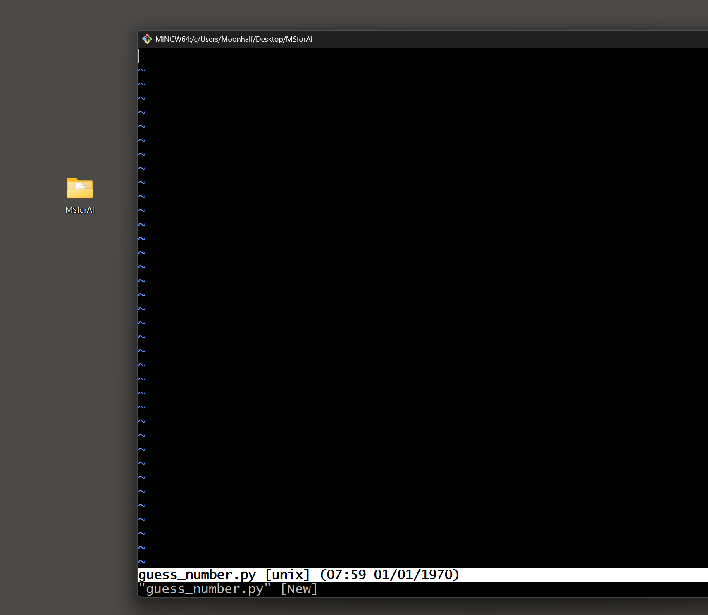

运用我们前面的知识已经足够进行基本的代码编写。我们先来定义一个`Digit`类方便后续的逐位比较：

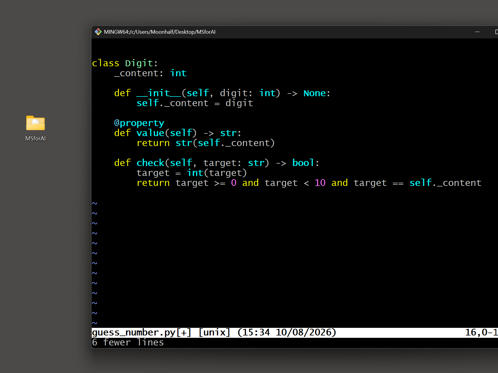

> 很多时候你发现看懂陌生项目的代码并不轻松，这是完全正常的情况。在ai时代应该学会善用llm快速理解不懂的知识。更重要的在于：即使llm能帮我们生成漂亮的代码，我们也不应该放任代码处在黑盒状态。人是代码的最终受益者，作为程序员，对代码负责本身就是在对自己负责，这也是为什么我们仍然需要学习代码。

之后我们来定义一个`Sequence`类，来表示一个数字序列并方便后续的判断：

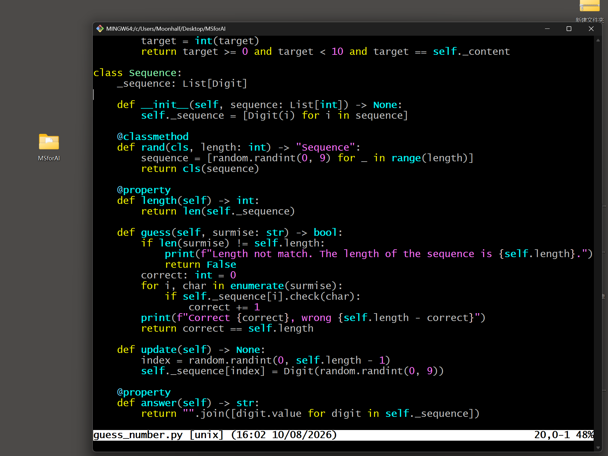

最后，完成`main()`函数。

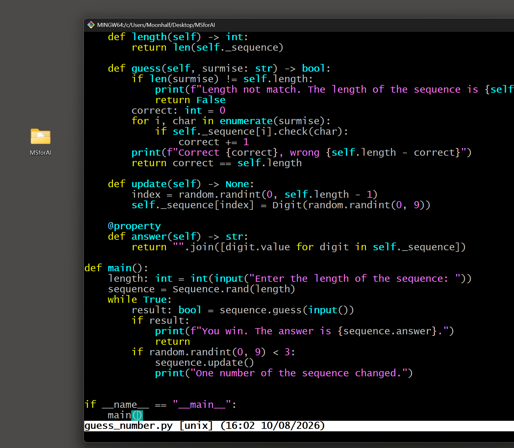

按照前面的操作指南，保存并退出。

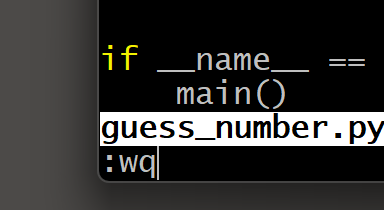

之后使用`python guess_number.py`即可运行程序。

完整的代码如下：

```python
from typing import List
import random

class Digit:
    _content: int

    def __init__(self, digit: int) -> None:
        self._content = digit

    @property
    def value(self) -> str:
        return str(self._content)

    def check(self, target: str) -> bool:
        target = int(target)
        return target >= 0 and target < 10 and target == self._content

class Sequence:
    _sequence: List[Digit]

    def __init__(self, sequence: List[int]) -> None:
        self._sequence = [Digit(i) for i in sequence]

    @classmethod
    def rand(cls, length: int) -> "Sequence":
        sequence = [random.randint(0, 9) for _ in range(length)]
        return cls(sequence)

    @property
    def length(self) -> int:
        return len(self._sequence)

    def guess(self, surmise: str) -> bool:
        if len(surmise) != self.length:
            print(f"Length not match. The length of the sequence is {self.length}.")
            return False
        correct: int = 0
        for i, char in enumerate(surmise):
            if self._sequence[i].check(char):
                correct += 1
        print(f"Correct {correct}, wrong {self.length - correct}")
        return correct == self.length

    def update(self) -> None:
        index = random.randint(0, self.length - 1)
        self._sequence[index] = Digit(random.randint(0, 9))

    @property
    def answer(self) -> str:
        return "".join([digit.value for digit in self._sequence]) 

def main():
    length: int = int(input("Enter the length of the sequence: "))
    sequence = Sequence.rand(length)
    while True:
        result: bool = sequence.guess(input())
        if result:
            print(f"You win. The answer is {sequence.answer}.")
            return 
        if random.randint(0, 9) < 3:
            sequence.update()
            print("One number of the sequence changed.")


if __name__ == "__main__":
    main()
```

以上代码系古法手工编写。

#### Neovim（选）

在以上的例子中，我们注意到vim虽然自带语法高亮，但是并不自带代码补全和语法诊断，导致实际用于写代码并不方便。Neovim是vim的现代重构版，使用lua作为内置配置以及插件语言，更加现代，性能更好，而基于neovim又诞生了很多neovim发行版，可以提供开箱即用的开发环境。

笔者是Neovim发行版中Lazyvim的忠实用户，日常开发工作都在neovim以及终端中完成。笔者认为neovim相比于拥有独立gui的文本编辑器，其最大的优势在于几乎可以忽略不计的启动时间以及使用tui作为前端。这意味着你可以在终端中完成所有工作，无需频繁切换窗口。Lazyvim则添加了方便的Lazy Extra功能，可以方便地一键添加对某语言的支持。

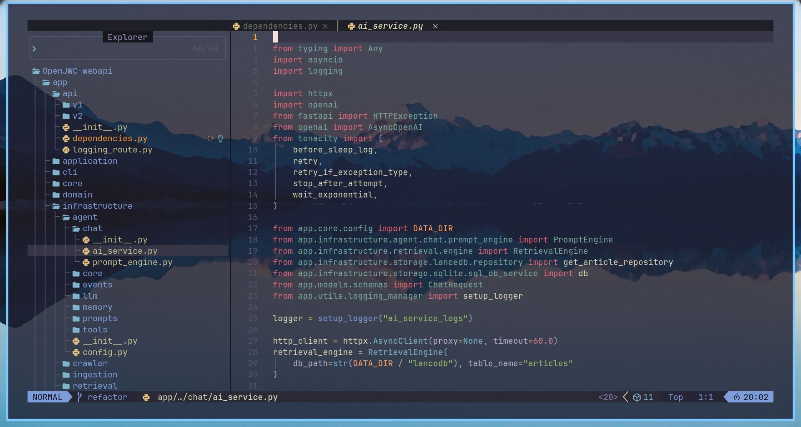

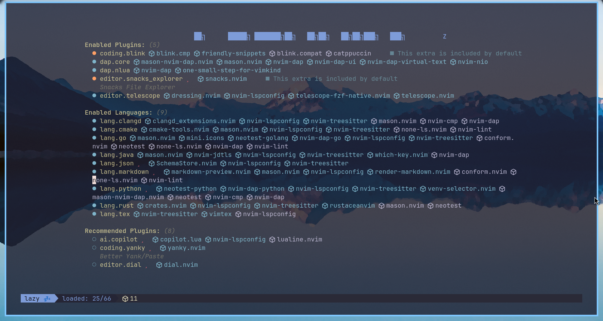

（神秘的摆拍效果图）

## 为什么你的命令行很无聊？

讲到这里，你可能会发现你的git bash非常的“无聊”：它只会在一个黑洞洞的窗口中原封不动地接受你输入的指令，之后执行再返回。你每次都要手动完整的输入指令，而且界面看起来并不是很现代。显然，开发者不会满足于现有的体验。事实上，我们有一大把的方式来优化体验。

我们来先列一个需求清单：

- 需要够好看。黢黑的终端显然不满足（虽然已经很酷了）。
- 需要有语法诊断，避免输入错误的指令。
- 需要有自动补全，这样就不用每次都输入完整的指令了。

假如你在使用wsl，事实上你可以安装zsh来代替bash，因为zsh是更加现代的shell。不过，既然我们已经安装了bash，不妨对其进行改造来满足我们的需求。

[oh-my-bash github](https://github.com/ohmybash/oh-my-bash)

对于终端的改造，我们选择将bash挂入Windows Terminal，因为Windows Terminal相比于Git Bash自带的终端更加现代；对于bash美化则采用**Oh My Bash**。这是一个社区维护的bash配置框架，可以用来管理主题与插件。

```sh
sh -c "$(curl -fsSL https://raw.githubusercontent.com/ohmybash/oh-my-bash/master/tools/install.sh)"
```

以上是安装指令，由ohmybash的github主页中复制并改为了`sh`来解释执行。如果你不信任本站，请你自行前往主页获取最新的指令。

效果如下图：

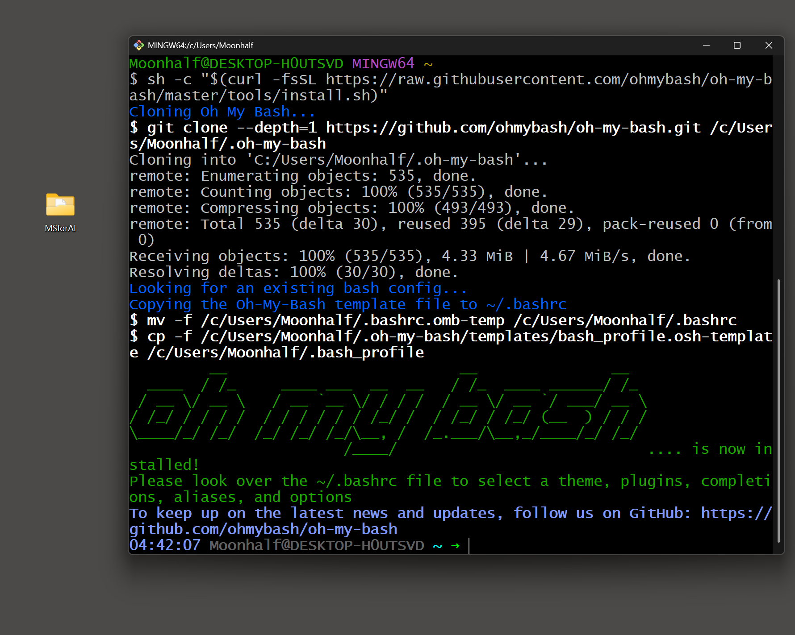

ohmybash的配置文件存放于`~/bashrc`（`~`的含义在前文已经提过，代表家目录）。我们通过修改本配置文件来配置主题和插件。

以下呈现最终的配置成果：

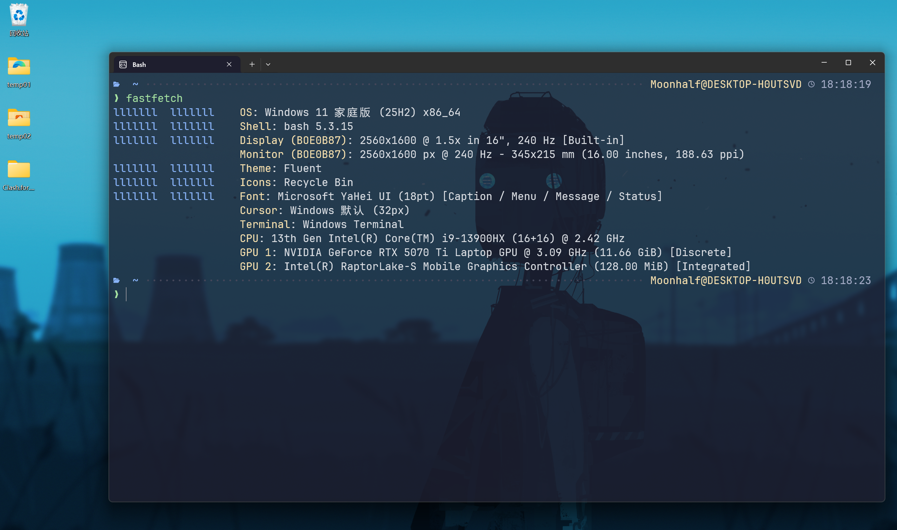

详细的配置方法就不在这里罗列了，此处只给出一个配置清单：

- 终端字体Jetbrains Nerd Font，可以使用winget安装。
- 安装ohmybash，并将主题改为powerbash10k。
- windows terminal设置中修改主题配色和字体，以及终端透明度等。
- 安装ble.sh提供语法高亮和自动补全。
- 安装fastfetch抓取系统信息，可以使用winget安装。
